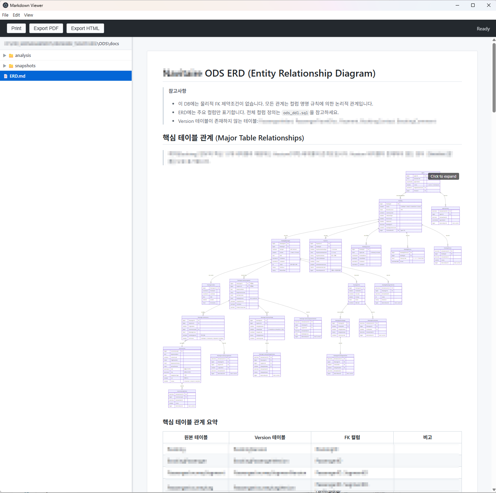

# MD Viewer

Markdown 파일을 보기 위한 데스크톱 앱입니다. Electron 기반이며, Mermaid 다이어그램과 코드 구문 강조를 지원합니다.



## 기능

- Markdown 렌더링 (GitHub 스타일)
- 코드 블록 구문 강조 (highlight.js)
- Mermaid 다이어그램 렌더링 + 전체화면 뷰어 (확대/축소/이동)
- JSON 코드 블록 접기/펴기 트리 뷰
- 폴더 내 .md 파일 트리 탐색 (하위 폴더 포함)
- PDF / HTML 내보내기
- 인쇄 기능
- 문서 내 검색 (Ctrl+F / Cmd+F)
- 창 크기/위치, 사이드바 너비 기억
- 커맨드라인에서 파일 직접 열기
- Windows / macOS 지원

---

## 빠른 시작 (사용자)

빌드된 실행 파일만 사용하려면 아래 단계를 따르세요.

### Windows

1. [Releases](https://github.com/hanbroz/md-viewer/releases) 페이지에서 `MD_Viewer_xxxx.xx.xx.xxxxxx.zip` 파일을 다운로드합니다.
2. 원하는 폴더에 압축을 풉니다.
3. `MD Viewer.exe`를 더블클릭하면 실행됩니다.

### macOS

1. [Releases](https://github.com/hanbroz/md-viewer/releases) 페이지에서 Mac용 `.zip` 파일을 다운로드합니다.
2. 압축을 풀면 `MD Viewer.app`이 생성됩니다.
3. `MD Viewer.app`을 더블클릭하면 실행됩니다.
   - 처음 실행 시 "확인되지 않은 개발자" 경고가 나오면:  
     `시스템 설정 > 개인정보 보호 및 보안`에서 "확인 없이 열기"를 클릭합니다.

---

## 개발자 설치 및 실행

소스 코드를 직접 빌드하려면 아래 단계를 따르세요.

### 필수 조건

- [Node.js](https://nodejs.org/) 18 이상
- [Git](https://git-scm.com/)

### 1단계: 소스 코드 다운로드

```bash
git clone https://github.com/hanbroz/md-viewer.git
cd md-viewer
```

### 2단계: 의존성 설치

```bash
npm install
```

### 3단계: 개발 모드로 실행

```bash
# 렌더러 번들 빌드
npm run build:renderer

# 앱 실행
npm start
```

### 4단계: 배포용 빌드

#### Windows (EXE)

```bash
npm run build
```

빌드 결과: `release/MD Viewer-win32-x64/MD Viewer.exe`

#### macOS (APP) — Mac에서 실행해야 합니다

```bash
npm run build:mac
```

빌드 결과: `release/MD Viewer-darwin-universal/MD Viewer.app`

> macOS 빌드는 반드시 Mac에서 실행해야 합니다. Windows에서는 Mac용 빌드가 불가능합니다.

---

## 사용법

### 파일 열기

- 메뉴: `File > Open File...` (Ctrl+O / Cmd+O)
- 또는 커맨드라인에서:

```bash
# Windows
"MD Viewer.exe" path/to/file.md

# macOS
open "MD Viewer.app" --args path/to/file.md

# 개발 모드
npm start -- path/to/file.md
```

### 폴더 열기

- 메뉴: `File > Open Folder...` (Ctrl+Shift+O / Cmd+Shift+O)
- 사이드바에 하위 폴더 포함 트리 구조로 .md 파일이 표시됩니다.

### 검색

- `Ctrl+F` (Windows) / `Cmd+F` (macOS): 문서 내 텍스트 검색
- `Enter`: 다음 결과 / `Shift+Enter`: 이전 결과
- `Esc`: 검색 닫기

### Mermaid 다이어그램 뷰어

- 다이어그램을 **클릭**하면 전체화면 뷰어가 열립니다.
- **마우스 휠**: 확대/축소
- **드래그**: 이동
- **+/-**: 확대/축소, **0**: 원래 크기, **F**: 화면에 맞추기
- **Esc** 또는 **✕ 버튼**: 닫기

### 내보내기

- `Export PDF`: 현재 문서를 PDF로 저장
- `Export HTML`: 현재 문서를 HTML로 저장
- `Print`: 인쇄

---

## 프로젝트 구조

```
├── main.js              # Electron 메인 프로세스
├── preload.js           # IPC 브릿지 (contextBridge)
├── renderer.js          # 렌더러 소스 (marked + highlight.js)
├── index.html           # 메인 UI
├── package.json         # 의존성 및 빌드 스크립트
├── scripts/
│   └── build.js         # dist/ 빌드 스크립트
├── dist/                # (빌드 산출물, git 미포함)
│   ├── renderer.bundle.js
│   ├── github-markdown.css
│   ├── hljs-github.css
│   └── mermaid.min.js
└── _sample/             # 테스트용 샘플 .md 파일
```

## 라이선스

ISC
