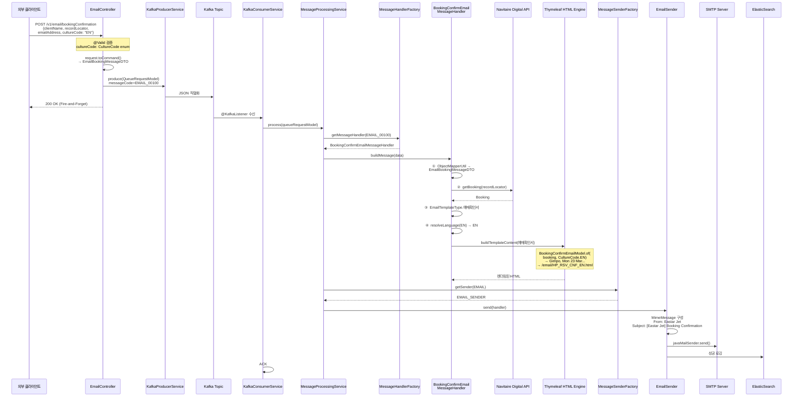
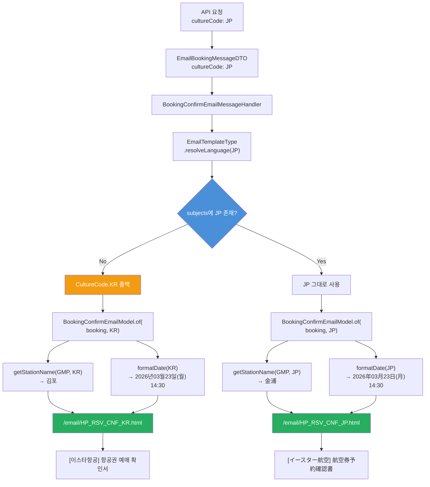
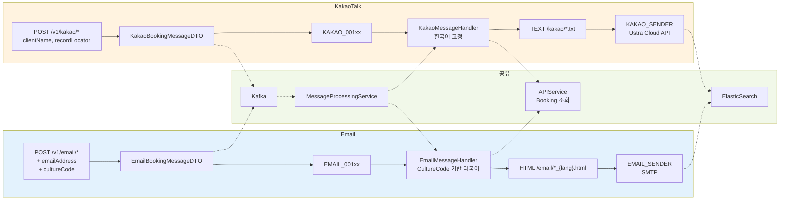
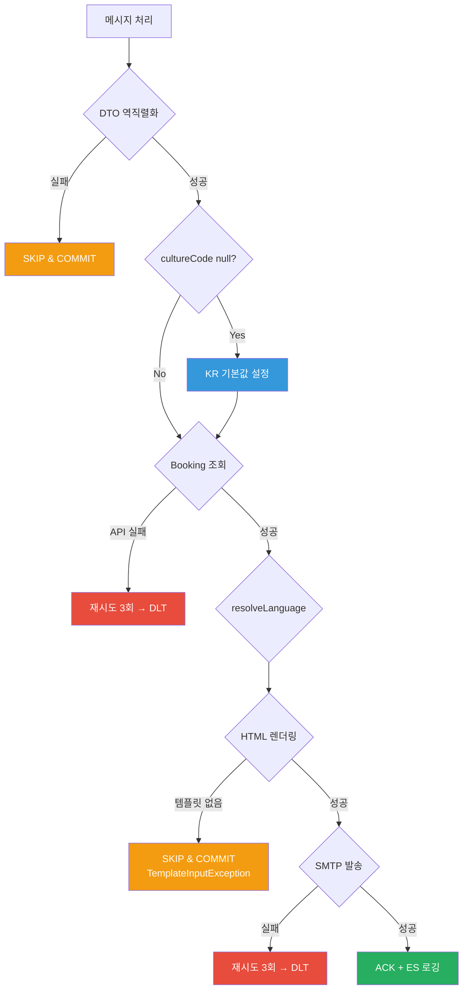
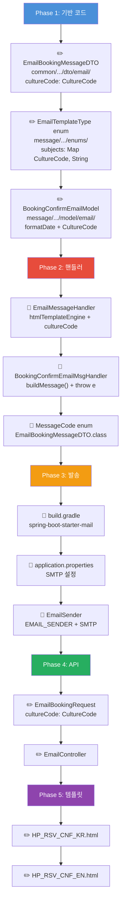

# 전체 처리 흐름 — Email 예매확인서

---

## 1. End-to-End Sequence Diagram

---

## 2. 다국어 + 폴백 흐름

---

## 3. 파이프라인 비교

---

## 4. 에러 시나리오

---

## 5. 구현 체크리스트

**범례**: ✏️ 신규 생성, 🔧 기존 수정
**총 파일**: 신규 8개 + 수정 5개 + 설정 3개 = 16개
